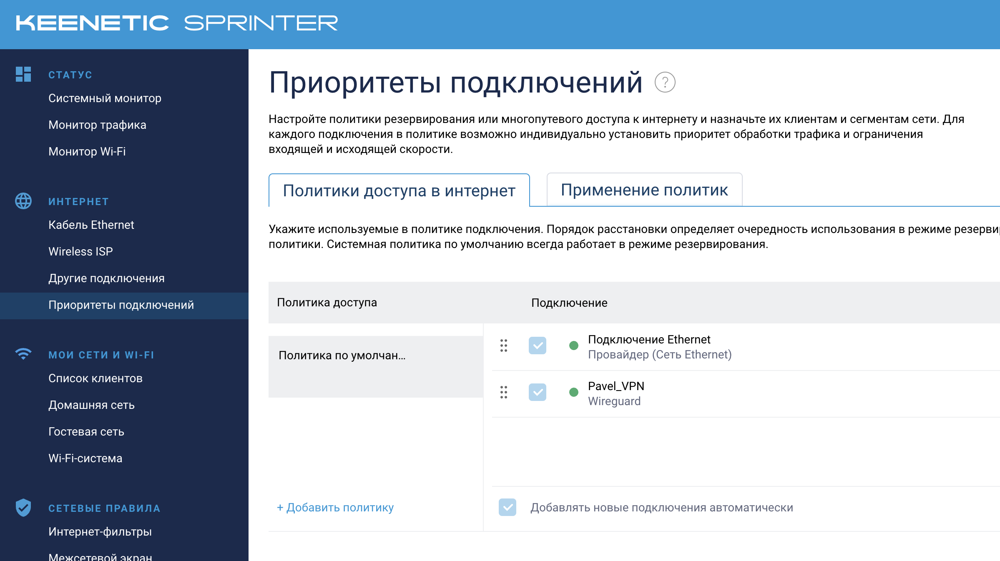
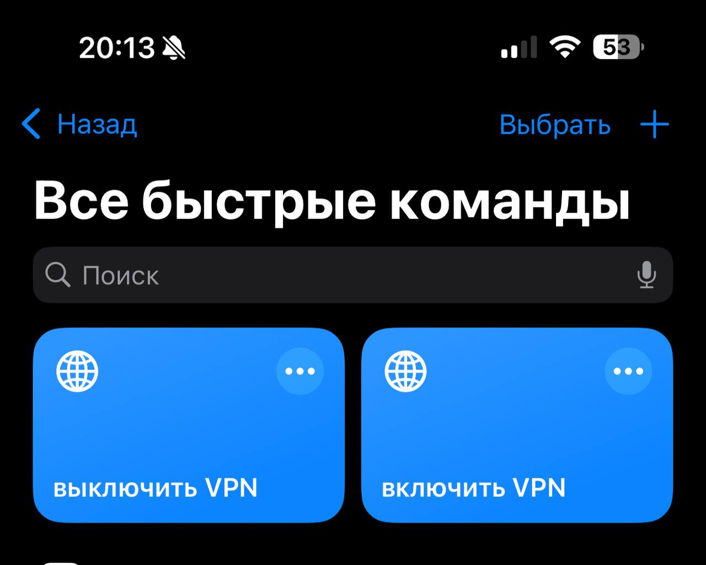

Привет! В данном гайде я расскажу как я решил проблему с блокировкой тех или иных сайтов у себя дома. Для себя я ставил цель сделать так, чтобы VPN был на уровне роутера, то есть чтобы не нужно было включать VPN через какую-либо программу на устройстве. 

У меня получилось прийти к следующему результату - после того, как я подключаюсь к домашнему wi-fi я могу заходить на ресурсы, которые недоступны без VPN (именно для них по системе white-list используется VPN). Для все остальных ресурсов используется обычный интернет (чтобы не терять в скорости, например, во время игр в шутеры, где большой пинг неприемлем)

Для этого мне понадобилось: 
1) VPS в Хельсинках с VPN сервером 
2) Роутер Keenetic Sprinter
3) Список IP адресов, для которых используем VPN. 
Дополнительно: 
1) Свой VPN на телефон
2) Расширение площади покрытия wi-fi
## Поднимаем свой VPN сервер

Переходим на сайт https://aeza.net/?ref=518179 
Регистрируемся, привязываем телеграм и нажимаем "смотреть тарифы VPS/VDS"

Нас интересует самый дешевый Shared сервер в Хельсинках


Выбираем предустановленное ПО WG Easy 
Не забываем отключить бэкапы, тут они нам ни к чему


После того, как оплатили нужно совсем немного подождать. Вскоре нам в телеграм AEZA пришлет данные для входа на наш сервер. 


Теперь нам необходимо зайти на сервер чтобы узнать данные для входа в панель управления wg-easy.
Для этого открываем терминал и пишем команду в формате: 

```shell
ssh root@127.0.0.1
```

IP адрес 127.0.0.1. нужно поменять на адрес сервера полученный в сообщении от AEZA. 
Вводим пароль (если вы не видите как печатаются символы - это нормально, просто вводим пароль и нажимаем Enter)

Если все получилось, то мы увидим примерно такое приветственное сообщение: 


Далее нам нужно прочитать файл wg-easy.txt, для этого  пишем команду: 
```shell
cat wg-easy.txt
```

И получаем такой ответ: 


Переходим по ссылке, которая написана в файле и входим. 


Нажимаем "New", пишем имя клиента (Себе я написал "Pavel_VPN") и скачиваем конфиг нажав на кнопку: 


На этом подготовительная часть с нашим личным VPN сервером подошла к концу. Ура, теперь у нас есть свой личный VPN сервер! 

## Покупка, настройка и роутера 

Я покупал себе роутер Keenetic Sprinter, поэтому буду объяснять как делать на нем. Если у вас уже есть роутер с поддержкой VPN, можете воспользоваться им. 

После распаковки включаем роутер и при помощи мастера установки производим первичную настройку. 

**Примечание**: *лично я и мой знакомый сталкивался с ситуацией, когда на одном из последних этапов мастера установка полностью зависала. В этом случае спас сброс роутера до заводских настроек (маленькая кнопка непосредственно на роутере) и перезагрузка. Дальше заново нужно пройти мастера установки, но в этот раз зависания не будет.* 

После того, как мы прошли мастера установки и подключили роутер к интернету переходим к его настройке. 

Заходим в настройки роутера "Параметры системы":


Нажимаем "Изменить набор компонентов". Пишем в поиске "WireGuard" и устанавливаем:


После установки пишем в поиске Wireguard чтобы перейти к его настройкам. 


Попадаем на страницу "Другие подключения" и тут нажимаем "Добавить из Файла". Выбираем файл который сохранили в конце первого раздела этого гайда. 

Пишем имя пира (например wg1)
**Важно**: добавьте проверку активности! (Например 30) 
Иначе роутер не будет подключаться к нашему VPN серверу. 
**Обязательно ставим галочку** "Использовать для выхода в интернет" ("Use for accessing the Internet")


В результате увидим такую картину: 


Активируем это новое соединение. Около имени в поле "Пир" должен появиться зелёные огонёк. 

Далее проверяем "Политики". Должно быть так: 

## Добавляем IP адреса необходимых ресурсов для VPN подключения

Берем необходимые адреса отсюда (Я использовал **Маршруты для загрузки в роутер Keenetic**  
  
Маршруты для Youtube + TV + insta+ torrent+ meta + m.youtube_0.0.7 - [скачать](https://disk.yandex.ru/d/diUHkt7hZNmiKw) (обновлено 19.08.2024))
https://rockblack.su/vpn/dopolnitelno/diapazon-ip-adresov

Далее на этой же странице переходим в раздел "# **Как добавить маршрут в роутер Keenetic**" и повторяем гайд. 

Получим примерно такой результат: 


Чтобы проверить, что всё работает корректно: 
1) Заходим на сайт https://2ip.ru/ - должно показывать ваш домашний IP 
2) Заходим на сайт, куда ранее не могли заходить - должно открываться

Если все работает корректно - поздравляю! Вы все сделали правильно. 

## VPN на телефоне

Не знаю почему, но у меня на телефоне почему-то не подключается к нашем wireguard серверу. 

Но есть другое решение - Amnezia VPN

Переходите на сайт https://amnezia.org/ru, скачиваете клиент для своего устройства. 

После установки выбираете "Self-hosted VPN", вводите IP адрес, логин и пароль от вашего сервера, немного ждете и..

Всё! Ваш VPN на телефоне готов! 

Теперь когда нужно будет им воспользоваться просто включаете в Amnezia VPN. 

При большом желании можно настроить чтобы VPN амнезии включался автоматически, лично я так и сделал. 

Пример на iOS (использовано приложение "Команды"): 



## Дополнительно
#### Расширение площади wi-fi покрытия

Для большого дома можно расширить сеть wi-fi использую Keenetic Mash систему. 
Отлично подойдет "Ретранслятор Wi-Fi сигнала Keenetic Buddy 6 (KN-3411)"
В таком случае подключение по всему дому будет "бесшовным" то есть где бы вы не находились, ваше устройство будет всегда подключено к одной сети. 

Если хочется сэкономить, то можно использовать любые другие ретрансляторы сигнала, но велик шанс, что подключение не будет "бесшовным", то есть будет постоянно отключаться от одного и подключаться к другому источнику wi-fi сигнала в вашем доме. 
